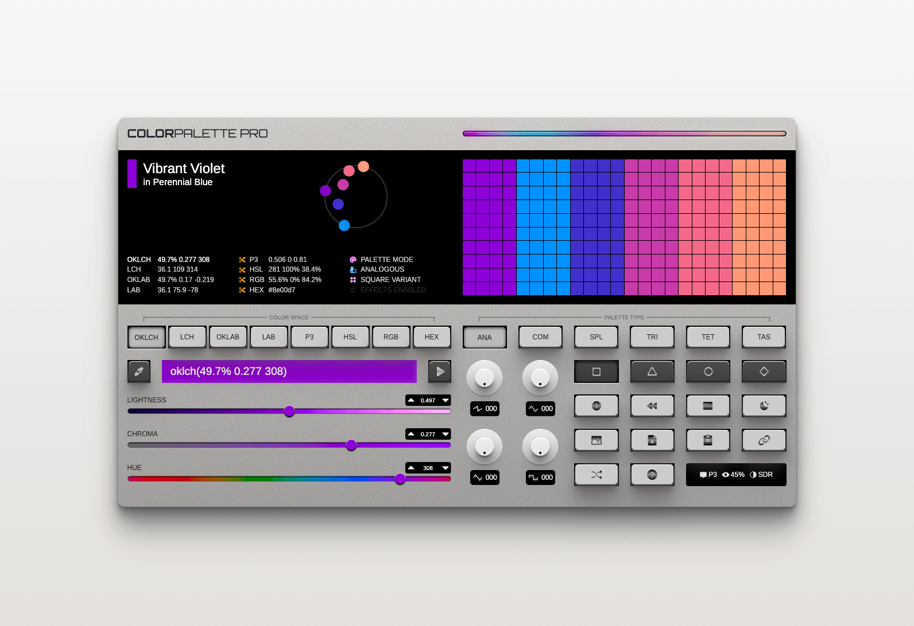

# Color Palette Pro

A synthesizer for color palettes. Generate customizable color palettes in advanced color spaces that can be easily shared, downloaded, or exported.

**🌐 [Try it live at colorpalette.pro](https://colorpalette.pro)**

## About

Color Palette Pro generates 6 different color palettes (Analogous, Complementary, Split Complementary, Triadic, Tetradic, and Tints & Shades) in 4 styles across 8 color spaces and formats. It provides a synthesizer-like interface for creating beautiful color palettes for artworks, websites, and designs.

For more information about the project, check out the [blog post](https://ryanfeigenbaum.com/color-palette-pro/).

## Video Demo

<iframe width="560" height="315" src="https://www.youtube.com/embed/2B8ZMgj0jDs" title="Color Palette Pro Demo" frameborder="0" allow="accelerometer; autoplay; clipboard-write; encrypted-media; gyroscope; picture-in-picture; web-share" allowfullscreen></iframe>

## Features

- Generate 6 programmatic palette types with 4 variations each
- Support for multiple color spaces (OKLCH, LAB, LCH, HSL, RGB, etc.)
- Multiple input methods: text input, sliders, eyedropper, history, random, and URL
- Export options: CSS variables, CSS file download, and palette images
- UI mode for generating color palettes suitable for user interfaces
- Dark mode support

For detailed documentation, click the **?** button in the app to access the manual, or see [`src/components/manual/Manual.tsx`](src/components/manual/Manual.tsx) in the source code.

## Acknowledgments

This project would not be possible without these excellent libraries:

- **[Color.js](https://github.com/color-js/color.js)** — A fantastic TypeScript library for color science by Lea Verou and Chris Lilley, co-editors of the CSS color spec
- **[Color Name API](https://github.com/meodai/color-name-api)** — REST API that returns color names for given color values

## License

MIT License — see [LICENSE](LICENSE) for details.
