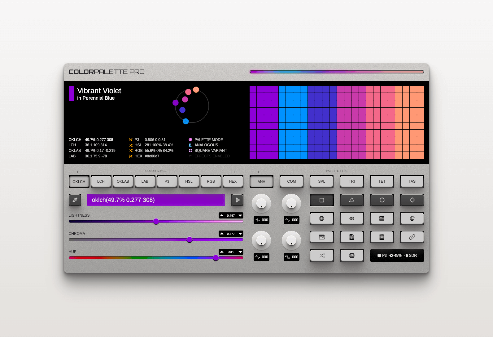

# ColorSuite Pro

A suite of tools for generating dynamic color palettes:

- [ColorPalette Pro](#colorpalette-pro) is a web app for creating palettes based on a single color. -[] -[]

## ColorPalette Pro

A synthesizer for color palettes. Generate customizable color palettes in advanced color spaces that can be easily
shared, downloaded, or exported.

**🌐 [Try it live at colorpalette.pro](https://colorpalette.pro)**



### About

Color Palette Pro generates 6 different color palettes (Analogous, Complementary, Split Complementary, Triadic,
Tetradic, and Tints & Shades) in 4 styles across 8 color spaces and formats. It provides a synthesizer-like interface
for creating beautiful color palettes for artworks, websites, and designs.

For more information about the project, check out the [blog post](https://ryanfeigenbaum.com/color-palette-pro/).

### Video Demo

[Check out a video demo on YouTube](https://www.youtube.com/embed/2B8ZMgj0jDs)

### Features

- Generate 6 programmatic palette types with 4 variations each
- Support for multiple color spaces (OKLCH, LAB, LCH, HSL, RGB, etc.)
- Multiple input methods: text input, sliders, eyedropper, history, random, and URL
- Export options: CSS variables, CSS file download, and palette images
- UI mode for generating color palettes suitable for user interfaces
- Dark mode support

For detailed documentation, click the **?** button in the app to access the manual, or see
[`src/components/manual/Manual.tsx`](src/components/manual/Manual.tsx) in the source code.

### Acknowledgments

This project would not be possible without these excellent libraries:

- **[Color.js](https://github.com/color-js/color.js)** — A fantastic TypeScript library for color science by Lea Verou
  and Chris Lilley, co-editors of the CSS color spec
- **[Color Name API](https://github.com/meodai/color-name-api)** — REST API that returns color names for given color
  values

## ColorPalette Pro Package

Use the ColorPalette Pro generator programmaticaly with the
[NPM package](https://www.npmjs.com/package/@royalfig/color-palette-pro).

```bash
pnpm add @royalfig/color-palette-pro
```

### Usage

```typescript
import { createPalettes, generateAnalogous } from 'color-palette-pro'

// Unified orchestration
const palettes = createPalettes('#3498db', 'ana', 'square', { space: 'oklch', format: 'hex' })

// Or access internal harmonic generators individually
const baseAnalogous = generateAnalogous('#3498db', { style: 'square', colorSpace: { space: 'oklch', format: 'hex' } })

// Or generate editor themes
const vscodeTheme = generate
```

## ColorCode Pro

[ColorCode Pro](https://code.colorpalette.pro) generates dynamic syntax-highlighted editor themes and code snippets.

### Theme Generation

1. Pick your base color. Use the color picker or input a hex code. The base color drives all theme types and styles.
1. Choose your theme type, which follow color harmonies.
1. The shapes (square, triangle, circle, diamond) indicate your theme style, increasing in chroma, left to right.
   Diamond verges on a neobrutalist design.
1. Flip between light and dark mode themes with the sun/moon toggle. The half-white, half-black icon follows your system
   preference.
1. Download your theme

#### Supported Editors and Terminals

Choose your output format with the caret button near the download button.

**VS Code (and forks)**

The best way I've found to add a local theme to VS Code is to follow the
[official guide for creating a custom theme](https://code.visualstudio.com/api/extension-guides/color-theme#create-a-new-color-theme).

This guide uses the Yeoman CLI tool to scaffold out a new theme. Then, you can swap out the default JSON file with the
one downloaded from ColorCode Pro. You just need to updated `package.json` to ensure that the filenames match. What's
nice is that you can add as many themes as you'd like and test them out, opting, for example, to include both dark and
light versions.

Then, add the theme folder to your `~/.vscode/extensions` directory.

**Zed**

Add the theme JSON file to `~/.config/zed` folder.

**Ghostty**

Add the theme JSON file to `~/.config/ghostty/themes` and update `config` with:

```bash
theme = color-code-ghostty-dark.conf
```

**Alacritty** See terminal documentation for how to load a custom theme.

**iTerm2** See terminal documentation for how to load a custom theme.

**Warp** See terminal documentation for how to load a custom theme.

### Code Snippets

Get HTML color-encoded code snippets for your blog post.

1. Enable snippet mode in the Settings menu. Download the base CSS and JS and add them to your site.
1. Copy the code snippet and add it to your post.

## License

MIT License — see [LICENSE](LICENSE) for details.
