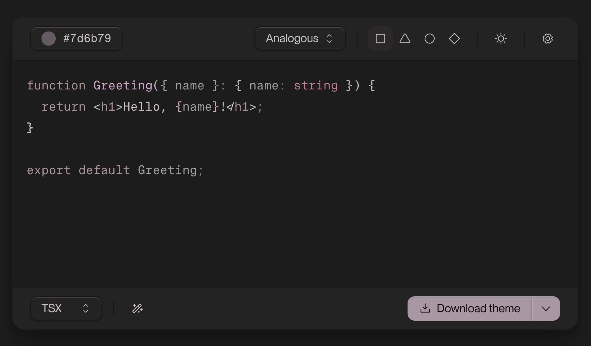

# ColorCode Pro



Generates dynamic syntax-highlighted editor themes and code snippets.

## Theme Generation

1. Pick your base color. Use the color picker or input a hex code. The base color drives all theme types and styles.
1. Choose your theme type, which follow color harmonies.
1. The shapes (square, triangle, circle, diamond) indicate your theme style, increasing in chroma, left to right. Diamond verges on a neobrutalist design.
1. Flip between light and dark mode themes with the sun/moon toggle. The half-white, half-black icon follows your system preference.
1. Download your theme

### Supported Editors and Terminals

Choose your output format with the caret button near the download button.

### VS Code (and forks)

The best way I've found to add a local theme to VS Code is to follow the [official guide for creating a custom theme](https://code.visualstudio.com/api/extension-guides/color-theme#create-a-new-color-theme).

This guide uses the Yeoman CLI tool to scaffold out a new theme. Then, you can swap out the default JSON file with the one downloaded from ColorCode Pro. You just need to updated `package.json` to ensure that the filenames match. What's nice is that you can add as many themes as you'd like and test them out, opting, for example, to include both dark and light versions.

Then, add the theme folder to your `~/.vscode/extensions` directory.

### Zed

Add the theme JSON file to `~/.config/zed` folder.

### Ghostty

Add the theme JSON file to `~/.config/ghostty/themes` and update `config` with:

```bash
theme = color-code-ghostty-dark.conf
```

### Alacritty
See terminal documentation for how to load a custom theme.

### iTerm2
See terminal documentation for how to load a custom theme.

### Warp
See terminal documentation for how to load a custom theme.

## Code Snippets

Get HTML color-encoded code snippets for your blog post.

1. Enable snippet mode in the Settings menu. Download the base CSS and JS and add them to your site.
1. Copy the code snippet and add it to your post.
